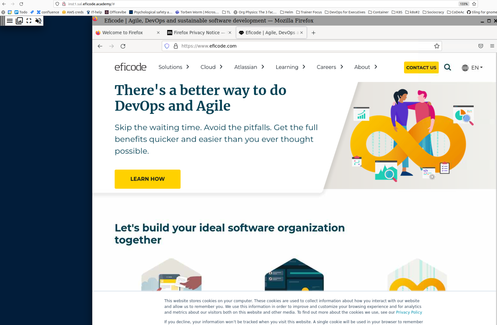

# firefox-in-docker (find)

Run Firefox in a docker container and forward over http using xpra, in order to have a graphical browser running on a remote machine.



**Motivation:** During trainings participants are often on a corporate network, and cannot access some IP addresses and ports.
We can work around this by giving them a browser running a remote server, that they can connect to, and then connect to the blocked IPs and ports from the remote browser.

This is implemented by using `XPra` to run Firefox in a docker container, and forward the Firefox session over HTTP to a client browser.

This could also be used for running other applications we need to run on remote machines.

# Usage

There are ready to use docker images available in the [ghcr.io](https://github.com/eficode-academy/firefox-in-docker/pkgs/container/find), use the `release` tag to get the latest stable version.

Using `docker run`

```sh
docker run --rm -d -p 80:10000 --restart always ghcr.io/eficode-academy/find:release
```

Using `docker-compose`

```sh
git clone https://github.com/eficode-academy/firefox-in-docker
cd firefox-in-docker
docker-compose up -d
```

You can access the firefox instance from a browser on port 80 either using `localhost` from the same machine, ie:

```http
http://localhost:80
```

If you are at a training and using a provided cloud machine, you should use the DNS name of your cloud machine:

```http
http://inst<your-number>.<trainer-initials>.eficode.academy:80
```

# Docker Images

There is a GitHub Actions pipeline set up to build and push a new version of the docker image on pushes to the `main` branch.
